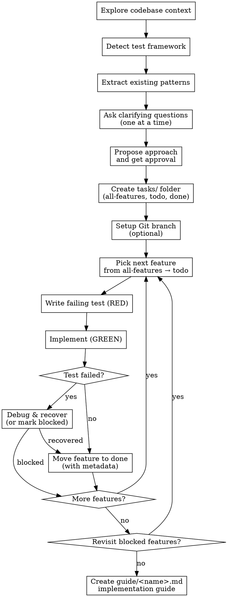

# Plan and Build

## Overview

A structured workflow that turns a vague feature idea or bug report into working, tested code — one small feature at a time. Combines targeted clarifying questions, TDD, and task tracking in a reusable folder structure.

**Core principle:** Ask first, build small, test first, document last.

## Process Flow



## Phase 0 — Detect Test Framework

Before exploring the feature space, figure out how this project tests. The TDD loop in Phase 4 depends on a working test command.

Detection checklist:
1. Read `package.json` → check `devDependencies` and `scripts.test` for: `vitest`, `jest`, `mocha`, `ava`, `playwright`, `cypress`, `bun test`, `deno test`
2. Look for config files: `vitest.config.*`, `jest.config.*`, `.mocharc*`, `pytest.ini`, `pyproject.toml` (`[tool.pytest]`), `phpunit.xml`, `Cargo.toml` (`[dev-dependencies]`), `go.mod`
3. Look for existing test files: `**/*.test.{ts,tsx,js,jsx}`, `**/*.spec.*`, `__tests__/`, `tests/`, `test/`, `*_test.go`, `test_*.py`
4. Note the **runner command** (e.g. `pnpm test`, `npm run test:unit`, `pytest -k`, `cargo test`) and the **single-file pattern** (e.g. `vitest run path/to/file.test.ts`)

Decision rules:
- **Framework found + tests exist** → record the runner command and continue
- **Framework found, no tests yet** → record the runner, scaffold the first test in Phase 4
- **No framework found** → ask the user: "I don't see a test framework. (A) Set up Vitest, (B) Set up Jest, (C) Skip TDD for this work, (D) I'll tell you the framework"
- **Unfamiliar framework** → ask: "How do I run a single test file in this project?"

Record the answer in the `tasks/all-features.md` header (see Phase 3) so future sessions don't re-detect.

## Phase 1 — Explore and Extract Patterns

Read the codebase before asking the user anything:
- Check existing files, services, routes, components related to the request
- Check `CLAUDE.md` for project conventions and patterns
- Check `tasks/` folder — if features already exist, jump to **Resuming Work** below

Then identify **2–3 existing features that resemble what's being built** and extract their patterns:

| Pattern | What to look for |
|---------|------------------|
| Naming | camelCase vs snake_case, file suffixes (`.service.ts`, `_handler.py`), test file naming |
| Directory layout | Where do similar features live? Co-located tests or separate `__tests__/`? |
| Error handling | Throw vs Result types vs error returns; centralized error middleware? |
| Logging | Which logger, what level conventions, what gets logged on error |
| API shape | REST resource style, RPC method names, response envelope (`{ data, error }` vs raw) |
| Validation | Zod, Pydantic, Joi, manual; where validation happens (boundary vs deep) |

If the codebase is **legacy or inconsistent** (different files use different patterns), surface the conflict and ask: "I see two patterns for X — (A) the older approach in `foo.ts`, (B) the newer approach in `bar.ts`. Which should I follow?"

After extracting, ask clarifying questions **one at a time**. Prefer multiple choice (A/B/C). Stop when you have enough to propose an approach. Typical questions:
- What is the core workflow / user action?
- Who uses it and what access do they have?
- What data needs to be collected or shown?
- What happens after the action completes?
- Does it need to integrate with existing systems (payments, auth, etc.)?

## Phase 2 — Propose and Approve

Present 2–3 approaches with trade-offs. Lead with your recommendation and why. Wait for explicit user approval before proceeding.

## Phase 3 — Task Folder Setup

Create these three files (or append to them if they already exist):

**`tasks/all-features.md`**
```markdown
# [Feature Name] — All Features

## Context
- **Test runner:** `<command from Phase 0>` (single-file: `<command> <path>`)
- **Patterns to follow:**
  - Naming: <e.g. camelCase, files end in `.service.ts`>
  - Errors: <e.g. throw `AppError`, caught by `errorMiddleware`>
  - Logging: <e.g. `pino` at `info`/`error`>
  - API shape: <e.g. REST, `{ data, error }` envelope>
- **Reference features:** `src/foo/`, `src/bar/`

## Features
- [ ] F01 — short description
- [ ] F02 — short description
...
```

**`tasks/todo.md`**
```markdown
# TODO

## F01 — [current feature]
Steps:
1. ...

## Blocked
_(features paused mid-implementation — see Phase 4.5)_
```

**`tasks/done.md`**
```markdown
# Done

_Completed features logged here with metadata._
```

Features must be **small and independent** — each one should be implementable in a single focused session. A feature that touches UI, service, and route is too big; split it.

## Phase 3.5 — Git Branch (optional)

Ask once after the task folder is set up: "Want me to set up a feature branch and commit per feature, or do you handle git yourself?"

If the user opts in (or `CLAUDE.md` declares a convention like `git-workflow: feature-branch-per-task`):
- **Branch:** `feature/<kebab-case-feature-name>` off the current default branch
- **Per-feature commits:** one commit when each feature moves to `done.md`, message format `F01: <short description>`
- **Final commit:** the implementation guide gets its own commit, message `docs: add <feature> manual testing guide`

If the user declines, or if `CLAUDE.md` says the user manages version control manually, **skip this phase entirely** — do not run git commands.

This phase is opt-in. When in doubt, ask. Never force a branch on a user who hasn't asked for one.

## Phase 4 — TDD Implementation (repeat per feature)

**REQUIRED SUB-SKILL:** Follow `superpowers:test-driven-development` strictly.

For each feature:

1. Update `tasks/todo.md` with the current feature
2. **Write the failing test first** — run it with the Phase 0 runner command and confirm it fails for the right reason
3. Write the minimal implementation to pass the test (follow patterns recorded in `all-features.md` header)
4. Run the test again — confirm green
5. Run the full test suite — confirm nothing else broke
6. Update `tasks/all-features.md` (check the box)
7. Append to `tasks/done.md` with metadata (see format below)
8. If Phase 3.5 was enabled, create the per-feature commit
9. Update `tasks/todo.md` to the next feature
10. Repeat

**Auto mode:** Unless the user has said to ask for permission, proceed through all features without pausing. Only stop if a feature requires a decision the user hasn't answered yet.

### `done.md` entry format

Append one block per completed feature:

```markdown
## F01 — [feature name] ✓
- **Tests:** 4/4 passing
- **Files changed:** 3 (1 new, 2 modified)
- **Lines:** +120 / -8
- **Complexity:** Medium — async DB write, external email call mocked
- **Notes:** <any non-obvious decision worth remembering>
```

Complexity rubric:
- **Low** — pure logic, single file, no I/O, no async
- **Medium** — async, one external dep, or touches 2–3 files
- **High** — multiple external deps, concurrency, transactions, or complex state machines

## Phase 4.5 — Error Recovery

When a test fails unexpectedly during implementation (red→green never goes green, or green→red after a passing run):

**REQUIRED SUB-SKILL:** Follow `superpowers:systematic-debugging` for the diagnostic loop.

Quick recovery checklist (in order):
1. **Re-read the test expectation** — does it match what you actually intended to build? Often the test is wrong.
2. **Run the failing test in isolation** — `<single-file runner> <path>` — confirm it's not a side-effect from a sibling test
3. **Add a logging line at the assertion** — print the actual vs expected value
4. **Check the patterns recorded in `all-features.md`** — did you drift from the project's error-handling or validation convention?
5. **Bisect the implementation** — comment out half, see which half breaks the test

**The 15-minute rule:** if you've been stuck on the same failing test for ~15 minutes with no narrowing of the cause, **stop and mark the feature blocked**. Don't grind.

To mark blocked:
1. Move the feature's section in `todo.md` from the active area to the **Blocked** section
2. Add a short note: what was tried, the last error message, and the hypothesis you couldn't verify
3. Pick the next feature from `all-features.md` and continue
4. After all unblocked features are done, return to blocked features with fresh context (often the next feature reveals the missing piece)

Example blocked entry:
```markdown
## Blocked
### F03 — webhook signature validation
- **Last error:** `Invalid signature` even with documented test vector
- **Tried:** swapped HMAC algorithms, checked encoding, verified secret
- **Hypothesis:** the upstream service may be using a non-standard canonical form — need their docs
```

## Phase 5 — Implementation Guide

When all features in `tasks/all-features.md` are checked (and any blocked features have been resolved or explicitly deferred):

Create `guide/<kebab-case-feature-name>.md` with:

```markdown
# [Feature Name] — Manual Testing Guide

## Prerequisites
[What must exist before testing — accounts, data, env vars]

## 1. [First test scenario]
Steps + expected result

## 2. [Second test scenario]
...

## Common Issues
| Issue | Likely cause | Fix |
```

The guide must be written for a human following it for the first time with no prior context.

If Phase 3.5 was enabled, commit the guide as the final commit on the branch.

## Rules

- **One question per message** during Phase 1
- **No production code before a failing test** — Iron Law
- **Features stay small** — if a feature takes more than one file to explain, split it
- **tasks/ folder is the source of truth** — always check it at the start of a session to resume work
- **Auto mode by default** — don't ask for permission between features unless blocked
- **15-minute debug cap** — mark blocked and move on rather than grinding

## Resuming Work

If `tasks/all-features.md` already exists, start here instead of Phase 0/1:
1. Read the **Context** section of `tasks/all-features.md` — adopt the recorded test runner and patterns; don't re-detect
2. Read `tasks/all-features.md` — find unchecked features
3. Read `tasks/done.md` — understand what's already built (and the metadata of past features for sizing)
4. Read `tasks/todo.md` — check if a feature is in progress, and check the **Blocked** section
5. Continue from where work left off; consider blocked features first if you have new context

## Common Mistakes

| Mistake | Fix |
|---------|-----|
| Features too large | Split until each fits in one focused session |
| Test written after implementation | Delete the code, start over |
| Skipping the guide at the end | The guide is part of the deliverable — always write it |
| Stopping between features to ask permission | Work through all features unless blocked |
| Not reading codebase before questioning | Always explore first — avoids redundant questions |
| Not detecting test framework before starting | Detect in Phase 0 — discovering "no test runner" mid-implementation wastes the TDD cycle |
| Ignoring existing codebase patterns | Extract 2–3 reference features in Phase 1 — code that drifts from local convention is harder to review and maintain |
| Not documenting blocked features | Always write the **Blocked** entry with last error + hypothesis — without it, the next session re-treads the same dead ends |
| Committing all features in one giant commit | One commit per feature (when Phase 3.5 is enabled) — keeps review and rollback granular |
| Grinding past 15 minutes on a stuck test | Mark blocked, move on, return with fresh context |
