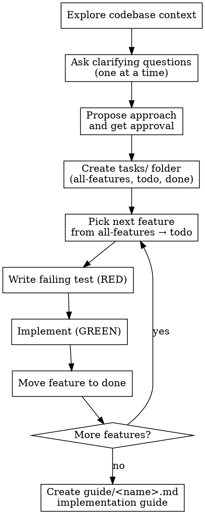

# Plan and Build

## Overview

A structured workflow that turns a vague feature idea or bug report into working, tested code — one small feature at a time. Combines targeted clarifying questions, TDD, and task tracking in a reusable folder structure.

**Core principle:** Ask first, build small, test first, document last.

## Process Flow



## Phase 1 — Explore and Question

Before asking anything, read the codebase:
- Check existing files, services, routes, components related to the request
- Check `CLAUDE.md` for project conventions and patterns
- Check `tasks/` folder — if features already exist, continue from where work left off

Then ask clarifying questions **one at a time**. Prefer multiple choice (A/B/C). Stop when you have enough to propose an approach. Typical questions cover:
- What is the core workflow / user action?
- Who uses it and what access do they have?
- What data needs to be collected or shown?
- What happens after the action completes?
- Does it need to integrate with existing systems (payments, auth, etc.)?

## Phase 2 — Propose and Approve

Present 2–3 approaches with trade-offs. Lead with your recommendation and why. Wait for explicit user approval before proceeding.

## Phase 3 — Task Folder Setup

Create these three files (or append to them if they already exist):

**`tasks/all-features.md`**
```markdown
# [Feature Name] — All Features

- [ ] F01 — short description
- [ ] F02 — short description
...
```

**`tasks/todo.md`**
```markdown
# TODO

## F01 — [current feature]
Steps:
1. ...
```

**`tasks/done.md`**
```markdown
# Done

_Completed features logged here._
```

Features must be **small and independent** — each one should be implementable in a single focused session. A feature that touches UI, service, and route is too big; split it.

## Phase 4 — TDD Implementation (repeat per feature)

**REQUIRED SUB-SKILL:** Follow `superpowers:test-driven-development` strictly.

For each feature:

1. Update `tasks/todo.md` with the current feature
2. **Write the failing test first** — run it and confirm it fails for the right reason
3. Write the minimal implementation to pass the test
4. Run the test again — confirm green
5. Run the full test suite — confirm nothing else broke
6. Update `tasks/all-features.md` (check the box)
7. Append to `tasks/done.md` with test count and summary
8. Update `tasks/todo.md` to the next feature
9. Repeat

**Auto mode:** Unless the user has said to ask for permission, proceed through all features without pausing. Only stop if a feature requires a decision the user hasn't answered yet.

## Phase 5 — Implementation Guide

When all features in `tasks/all-features.md` are checked:

Create `guide/<kebab-case-feature-name>.md` with:

```markdown
# [Feature Name] — Manual Testing Guide

## Prerequisites
[What must exist before testing — accounts, data, env vars]

## 1. [First test scenario]
Steps + expected result

## 2. [Second test scenario]
...

## Common Issues
| Issue | Likely cause | Fix |
```

The guide must be written for a human following it for the first time with no prior context.

## Rules

- **One question per message** during Phase 1
- **No production code before a failing test** — Iron Law
- **Features stay small** — if a feature takes more than one file to explain, split it
- **tasks/ folder is the source of truth** — always check it at the start of a session to resume work
- **Auto mode by default** — don't ask for permission between features unless blocked

## Resuming Work

If `tasks/all-features.md` already exists, start here instead of Phase 1:
1. Read `tasks/all-features.md` — find unchecked features
2. Read `tasks/done.md` — understand what's already built
3. Read `tasks/todo.md` — check if a feature is in progress
4. Continue from where work left off

## Common Mistakes

| Mistake | Fix |
|---------|-----|
| Features too large | Split until each fits in one focused session |
| Test written after implementation | Delete the code, start over |
| Skipping the guide at the end | The guide is part of the deliverable — always write it |
| Stopping between features to ask permission | Work through all features unless blocked |
| Not reading codebase before questioning | Always explore first — avoids redundant questions |
